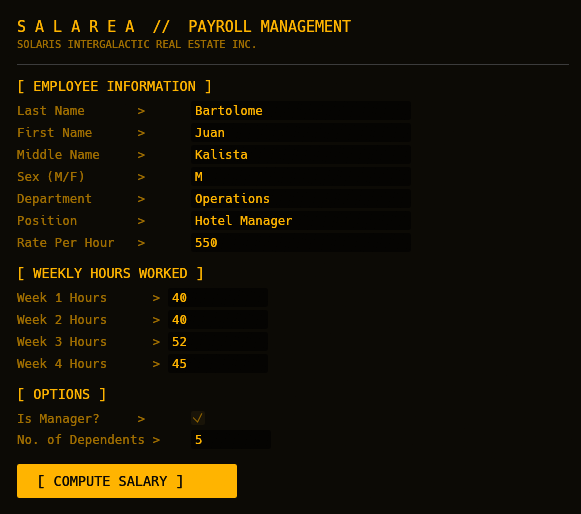
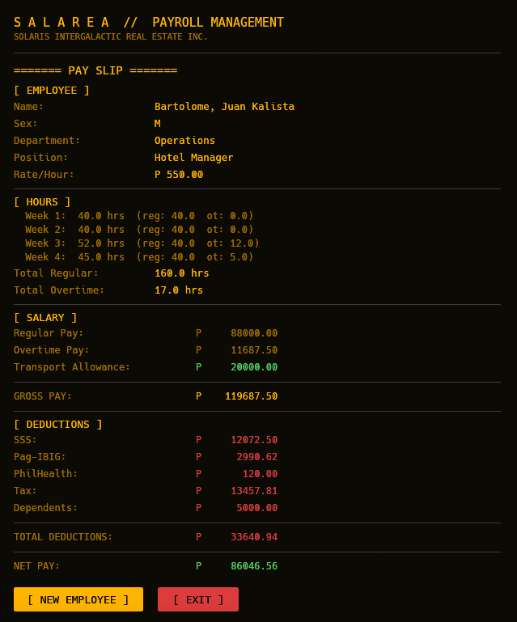

# Salarea | A Payroll Management System

Final project for **Programming Languages** subject.
Built in **Rust** using `eframe` + `egui` for the GUI.

Salarea is a TVA, Retro-Themed, Console Style, Salary Management Platform for Solaris, an Intergalactic Hotel and Real Estate Corporation (Fictional).




---

## What It Does

Salarea computes an employee's monthly salary based on weekly hours worked across four weeks. It handles regular pay, overtime, government-mandated deductions, and displays a formatted pay slip.

### Salary Computation

- **Regular hours**: 40 hrs/week. Anything beyond is overtime.
- **Overtime rate**: 125% of the hourly rate.
- **Gross pay**: `(rate × regular hours) + (rate × 1.25 × overtime hours)`

### Deductions

| Benefit | Rule |
|---|---|
| SSS | ≤5,000: ₱105 fixed / ≤10,000: 5% of GP / ≤15,000: 8% + ₱75 / >15,000: 12% + ₱110 |
| Pag-IBIG | <5,000: ₱100 fixed / ≥5,000: 3% of GP |
| PhilHealth | ₱120, or ₱0 if total hours worked < 10 |
| Tax | ≤10,000: 3% / ≤25,000: 8% / ≤40,000: 11% / >40,000: 13.5% |
| Dependents | ₱1,000 deducted per dependent |

### Allowances

Managers receive a **₱5,000/week transport allowance** (₱20,000/month), added to net pay.

### Net Pay

```
Net Pay = Gross Pay - Total Deductions + Transport Allowance
```

---

## Programming Languages Requirements Coverage

| Requirement | Implementation |
|---|---|
| **Identifiers & Variables** | `let`, `const`, struct fields with explicit types |
| **Declarations** | All variables declared with explicit types (`let rate: f64`, `let hours = [0.0f64; 4]`) |
| **Bindings** | Immutable bindings via `let`, mutable via `let mut`, pattern bindings in `match` |
| **Scope / Visibility / Lifetime** | `pub` for public API, private struct fields, local scope in `try_compute` |
| **Type Checking** | Rust's static type system; `.parse::<f64>()`, `char` validation at input boundary |
| **`char` type** | `sex: char` field on `PayResult`, validated as `'M'` or `'F'` |
| **Strings** | `String` for all employee info fields; `&str` for literals |
| **Arrays** | `[String; 4]` for raw input, `[f64; 4]` for computed hours |
| **ADTs / Other types** | `struct PayResult`, `enum Screen`, `Option<T>`, `u32`, `f64`, `bool` |
| **Control Structures** | `if/else` chains (SSS/tax brackets), `for` loops (weekly hours), `match` (screen routing, parse results) |
| **Functions** | `compute_gp`, `compute_ded`, `compute_np` — all return values to the caller per spec requirement 15 |

---

## Project Structure

```
src/
├── main.rs        — entry point, window config
├── app.rs         — UI logic, input/result screens, SalareaApp state
├── compute.rs     — salary computation functions + PayResult struct
├── constants.rs   — all numeric constants
├── style.rs       — color and font helpers
└── widgets.rs     — reusable UI row helpers (lv, mrow, sep)
```

---

## Why egui?

`egui` (via `eframe`) is an immediate-mode GUI library for Rust. It was chosen because:

- UI is written in pure Rust, no markup, no XML, no separate templating language. This keeps the entire project within the assigned language.
- Zero external runtime dependencies. Ships as a single binary.
- Full control over styling, layout, and application state.

---

## Dependencies

```toml
[dependencies]
eframe = "0.31"
egui = "0.31"
```

---

## Prerequisites

- [Rust](https://rustup.rs/) (stable toolchain, 1.75 or newer)

On Windows, you may also need the [MSVC build tools](https://visualstudio.microsoft.com/visual-cpp-build-tools/) or the GNU target via `rustup`.

---

## Build and Run

### Run in development

```bash
git clone https://github.com/cppdacl/Salarea.git
cd Salarea
cargo run
```

### Build release binary

```bash
cargo build --release
```

Output: `target/release/Salarea` (or `Salarea.exe` on Windows).

---

## Usage

1. Fill in employee information. Name, department, position, sex, and rate per hour.
2. Enter hours worked for each of the 4 weeks.
3. Check **Is Manager** if applicable and enter the number of dependents.
4. Click **COMPUTE SALARY** to generate the pay slip.
5. Click **NEW EMPLOYEE** to reset and process another employee, or **EXIT** to close.

---

*Solaris Intergalactic Real Estate Inc. | Salarea Payroll System*